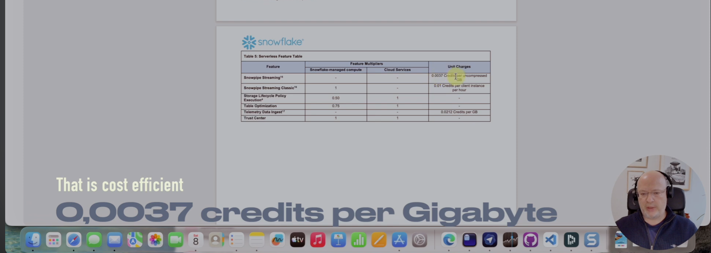

# evsnow

[](https://www.youtube.com/watch?v=zX3K-rfNZIU)

Video: Click the image above for a walkthrough of this repo.

[](https://github.com/MiguelElGallo/evsnow/actions/workflows/tests.yml)
[](https://github.com/MiguelElGallo/evsnow/actions/workflows/ci-cd.yml)
[](https://codecov.io/gh/MiguelElGallo/evsnow)
[](https://codspeed.io/MiguelElGallo/evsnow?utm_source=badge)
Stream data from Azure Event Hubs to Snowflake in real-time with built-in checkpointing and observability.

Now supports streaming directly to Snowflake-managed Iceberg tables.

EvSnow can stream-ingest into **Apache Iceberg tables in Snowflake** using **Snowpipe Streaming**. The default setup uses Snowflake-managed internal Iceberg storage (`EXTERNAL_VOLUME = SNOWFLAKE_MANAGED`), so no Azure Blob external volume is required for the Iceberg target table.


See a [video](https://youtu.be/zX3K-rfNZIU) for a general overview.

## Prerequisites

- Python 3.13+ and `uv` installed
- Snowflake account/role with permission to create/use the target database, schema, and pipe
- Azure Event Hub namespace with read access (consumer group) and either `az login` or a connection string
- Ability to run OpenSSL to generate RSA keys for Snowflake key-pair auth
- Snowflake CLI `snow` (or Snowflake UI) to test key-pair auth and query Snowflake

## Install

```bash
# Clone the repository
git clone https://github.com/MiguelElGallo/evsnow.git
cd evsnow

# Install dependencies
uv sync

# CI/reproducible installs use the checked-in dependency lock
uv sync --locked

# Quickstart
uv run evsnow validate-config
uv run evsnow run --dry-run
```

## Configure

1) Copy and edit the environment file

```bash
cp .env.example .env
```

Then set your values in `.env`. The pipeline needs:

- **Azure Event Hub** (namespace, event hub name, consumer group, optional connection string)
- **Snowflake connection** (account, user, key pair, warehouse, database, schema, role)
- **Checkpoint/control table** for offsets
- **Topic → table mappings**

Key settings (example):

```bash
# Azure Event Hub
EVENTHUB_NAMESPACE=eventhu1.servicebus.windows.net
EVENTHUBNAME_1=topic1
EVENTHUBNAME_1_CONSUMER_GROUP=$Default

# Snowflake Connection
SNOWFLAKE_ACCOUNT=aaaaaa-bbbbbbb
SNOWFLAKE_USER=STREAMEV
SNOWFLAKE_PRIVATE_KEY_FILE=/path/to/rsa_key_encrypted.p8
SNOWFLAKE_PRIVATE_KEY_PASSWORD=your-password
SNOWFLAKE_WAREHOUSE=compute_wh
SNOWFLAKE_DATABASE=INGESTION
SNOWFLAKE_SCHEMA_NAME=PUBLIC
SNOWFLAKE_ROLE=STREAM
SNOWFLAKE_PIPE_NAME=EVENTS_TABLE_PIPE

# Control Table (for checkpointing)
TARGET_DB=CONTROL
TARGET_SCHEMA=PUBLIC
TARGET_TABLE=INGESTION_STATUS
CONTROL_TABLE_BACKEND=snowflake  # snowflake | postgres

# Postgres control table (only if CONTROL_TABLE_BACKEND=postgres)
CONTROL_PG_HOST=localhost
CONTROL_PG_PORT=5432
CONTROL_PG_USER=checkpoint_user
CONTROL_PG_PASSWORD=checkpoint_password
CONTROL_PG_SSLMODE=require
CONTROL_PG_AUTH_MODE=password  # password | azure_token

# Topic → Table Mapping
SNOWFLAKE_1_DATABASE=INGESTION
SNOWFLAKE_1_SCHEMA=PUBLIC
SNOWFLAKE_1_TABLE=EVENTS_TABLE1
SNOWFLAKE_1_BATCH=100
```

Snowpipe Streaming channels are generated per Event Hub partition. The base channel uses the configured pattern (`{event_hub}-{env}-{region}-{client_id}` by default), and each ingest batch appends a sanitized partition suffix such as `-p0`, `-p1`, or `-ppartition-1`. Keep `EVSNOW_CLIENT_ID` stable for a given running instance so channel names remain deterministic across restarts.

`SNOWFLAKE_SCHEMA_NAME` is the shared Snowflake connection schema used by pipe operations. `SNOWFLAKE_1_SCHEMA` is the destination schema for mapping 1.

Postgres control table notes:
- When `CONTROL_TABLE_BACKEND=postgres`, `TARGET_DB`, `TARGET_SCHEMA`, and `TARGET_TABLE` are normalized to lowercase unless quoted (e.g., `"Control"` keeps case).
- When `CONTROL_PG_AUTH_MODE=azure_token`, the app uses `DefaultAzureCredential` and passes the access token as the password; `CONTROL_PG_PASSWORD` is ignored. Ensure the Azure AD principal exists on the server and has access to the database/schema/table.

### Snowflake authentication

Generate RSA key pair for authentication:

```bash
# Generate keys
./generate_snowflake_keys.sh

# Assign public key to Snowflake user
# See SNOWFLAKE_QUICKSTART.md for detailed instructions
# Example: ALTER USER STREAMEV SET RSA_PUBLIC_KEY='MIIBIjANBgkqhki...';
```

Test the same RSA key with Snowflake CLI:

```bash
snow connection test \
  --account "$SNOWFLAKE_ACCOUNT" \
  --user "$SNOWFLAKE_USER" \
  --authenticator SNOWFLAKE_JWT \
  --private-key-path "$SNOWFLAKE_PRIVATE_KEY_FILE"
```

The `SNOWFLAKE_JWT` authenticator is required for private-key authentication.
EvSnow passes `SNOWFLAKE_PRIVATE_KEY_FILE` and `SNOWFLAKE_PRIVATE_KEY_PASSWORD`
directly to the Snowpipe Streaming SDK. It does not write an unencrypted copy
of the private key to a temporary file.

### Azure authentication

For Event Hub consumption, EvSnow uses `EVENTHUBNAME_{N}_CONNECTION_STRING` when it is set. Otherwise it uses the Azure CLI identity from `az login`; that identity needs `Azure Event Hubs Data Receiver` on the Event Hub or namespace.

```bash
az login
```

Or provide a least-privilege Listen connection string in `.env`:

```bash
EVENTHUBNAME_1_CONNECTION_STRING="Endpoint=sb://<namespace>.servicebus.windows.net/;SharedAccessKeyName=EvSnowListen;SharedAccessKey=<listen-key>"
```

`AZURE_EVENTHUB_CONNECTION_STRING` is used by `tools/eventhub_sender`, not by the main pipeline receiver.

## Use

```bash
# Validate configuration
uv run evsnow validate-config

# Run the pipeline
uv run evsnow run

# Check status
uv run evsnow status

# Dry run (test without ingesting)
uv run evsnow run --dry-run
```

### Starting Fresh (No Checkpoints)

When starting the pipeline **without existing checkpoints** (e.g., after truncating checkpoint tables), you can control how the consumer processes existing messages:

```bash
# Example: Starting fresh after truncating tables
snow sql -x \
  --account "$SNOWFLAKE_ACCOUNT" \
  --user "$SNOWFLAKE_USER" \
  --authenticator SNOWFLAKE_JWT \
  --private-key-file "$SNOWFLAKE_PRIVATE_KEY_FILE" \
  --role "$SNOWFLAKE_ROLE" \
  --warehouse "$SNOWFLAKE_WAREHOUSE" \
  -q "TRUNCATE TABLE ingestion.public.events_table1;"

snow sql -x \
  --account "$SNOWFLAKE_ACCOUNT" \
  --user "$SNOWFLAKE_USER" \
  --authenticator SNOWFLAKE_JWT \
  --private-key-file "$SNOWFLAKE_PRIVATE_KEY_FILE" \
  --role "$SNOWFLAKE_ROLE" \
  --warehouse "$SNOWFLAKE_WAREHOUSE" \
  -q "TRUNCATE TABLE control.public.ingestion_status;"

# Consumer will process based on STARTING_POSITION_ON_NO_CHECKPOINT setting
uv run evsnow run
```

**Starting Position Options** (in `.env`): choose where the consumer begins when **no checkpoints exist**. After checkpoints are saved, the setting is ignored (resume from checkpoint).

```bash
# Option 1: BEGINNING of stream (default, recommended)
# Processes ALL existing messages in the Event Hub partitions
# Use to ensure no messages are lost when starting fresh
EVENTHUBNAME_1_STARTING_POSITION_ON_NO_CHECKPOINT=-1

# Option 2: LATEST position
# Only processes messages that arrive AFTER the consumer connects
# Skips messages already in Event Hub
EVENTHUBNAME_1_STARTING_POSITION_ON_NO_CHECKPOINT=@latest

# Option 3: Event Hub offset 0
# This is a concrete offset, not a synonym for earliest. Prefer -1 for
# beginning-of-stream behavior unless you intentionally want offset 0.
EVENTHUBNAME_1_STARTING_POSITION_ON_NO_CHECKPOINT=0
```

**How It Works:**

1. **First run (no checkpoints):** Uses `STARTING_POSITION_ON_NO_CHECKPOINT` (`-1` = beginning; `@latest` = only new messages; `0` = offset zero).
2. **Subsequent runs (checkpoints exist):** Always resumes from the last saved checkpoint; the setting is ignored.
3. **After truncating checkpoints:** Same as first run again; uses the configured starting position.

**Official Azure Documentation:**
- [Event Hubs Event Position](https://learn.microsoft.com/en-us/azure/event-hubs/event-hubs-features#event-consumers)
- [Starting Position Options](https://learn.microsoft.com/en-us/python/api/azure-eventhub/azure.eventhub.eventhubconsumerclient#azure-eventhub-eventhubconsumerclient-receive)

**Recommendation:** 
- Use `-1` (default) for production to prevent message loss
- Use `@latest` for development/testing when you only want new messages
- Avoid `0` unless you specifically need to start from Event Hub offset zero

## Optional features

### Smart Retry (LLM-Powered)

Use LLM analysis to classify errors and decide whether to retry:

```bash
# Add to .env
SMART_RETRY_ENABLED=true
SMART_RETRY_LLM_PROVIDER=azure
SMART_RETRY_LLM_MODEL=gpt-4o-mini
SMART_RETRY_LLM_API_KEY=your-key
SMART_RETRY_LLM_ENDPOINT=https://your-deployment.cognitiveservices.azure.com/...
SMART_RETRY_MAX_ATTEMPTS=3
SMART_RETRY_TIMEOUT_SECONDS=10
SMART_RETRY_ENABLE_CACHING=true
```

Run with `--smart` flag:

```bash
uv run evsnow run --smart
```

### Logfire Observability

Send structured traces/logs for observability:

```bash
# Add to .env
LOGFIRE_ENABLED=true
LOGFIRE_TOKEN=your_logfire_token
LOGFIRE_SERVICE_NAME=evsnow
LOGFIRE_ENVIRONMENT=production
LOGFIRE_SEND_TO_LOGFIRE=true
LOGFIRE_CONSOLE_LOGGING=true
LOGFIRE_LOG_LEVEL=INFO
```

Get your token at [logfire.pydantic.dev](https://logfire.pydantic.dev)

### Snowpipe Streaming Configuration

The pipeline uses Snowflake's high-performance Snowpipe Streaming SDK with a
PIPE object. The checked-in lockfile currently resolves `snowpipe-streaming` to
`1.4.0`.

```bash
# Add to .env
SNOWFLAKE_PIPE_NAME=EVENTS_TABLE_PIPE
SNOWFLAKE_SCHEMA_NAME=PUBLIC

# Create the internal Iceberg table and PIPE in Snowflake (see setup_snowpipe_streaming.sql)
```

One PIPE serves the target table, while EvSnow opens one Snowpipe Streaming channel per Event Hub partition. A batch containing mixed partitions is split before ingestion, sorted by sequence number within each partition, and sent to channels named `<base-channel>-p<sanitized-partition>`.

Version `1.4.0` adds OAuth and Programmatic Access Token support in the SDK.
EvSnow still defaults to JWT/RSA key-pair auth because that keeps the runtime
configuration simple and works with Snowflake trial accounts.

Dependencies are managed through `pyproject.toml` and the checked-in `uv.lock`. Use `uv sync --locked` when you need the exact locked versions, and refresh the lock only when intentionally changing dependencies.

## Configuration reference

See [`.env.example`](./.env.example) for all available configuration options with detailed comments.

## Docs

- [Step by Step Guide](./SNOWFLAKE_COMPLETE_SETUP.md) - Setup guide for Snowflake
- [Snowflake Quickstart](./SNOWFLAKE_QUICKSTART.md) - Compact setup and validation checklist

## License

See [LICENSE](./LICENSE) for details.
