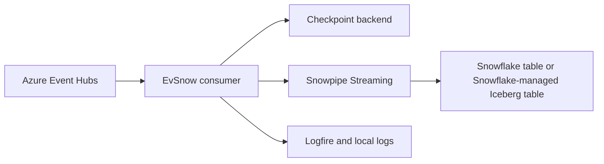
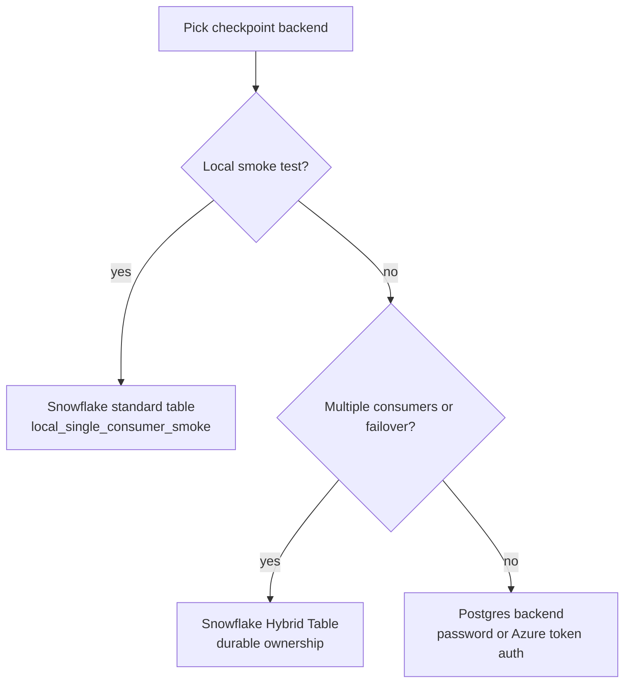

# EvSnow

EvSnow streams events from Azure Event Hubs into Snowflake with checkpointing,
configuration validation, and operational observability.

## Start With First Run

Start here when you want one Event Hub, one Snowflake target, one checkpoint
table, and a repeatable local smoke test.

Go to [First run](tutorial/first-run.md) to install EvSnow, configure one local
pipeline, validate the settings, and run it.

## Other Paths

- Set up Snowflake from scratch: [Snowflake quickstart](getting-started/snowflake-quickstart.md)
- Configure key-pair authentication: [Snowflake key-pair auth](snowflake/key-pair-auth.md)
- Tune runtime settings: [Configuration](configuration.md)
- Check every Snowflake object and grant: [Complete Snowflake setup](snowflake/complete-setup.md)
- Inspect Iceberg data with DuckDB: [DuckDB Iceberg guide](how-to/query-iceberg-with-duckdb.md)
- Run contributor checks: [Testing](development/testing.md)

## What EvSnow Connects

The Event Hub consumer reads from configured partitions. EvSnow writes data
through Snowpipe Streaming and records progress in a control backend. Later
runs resume from saved checkpoints.

## Runtime Choices

The local tutorial uses a Snowflake standard table and
`local_single_consumer_smoke`. Production deployments should use durable
ownership with a Snowflake Hybrid Table or the Postgres control-table backend.

## After First Run

Use the Snowflake setup pages when you need to create or audit account objects.
Use the configuration reference when you are changing pipeline behavior. Use the
how-to guides for operational tasks after the first pipeline works.
