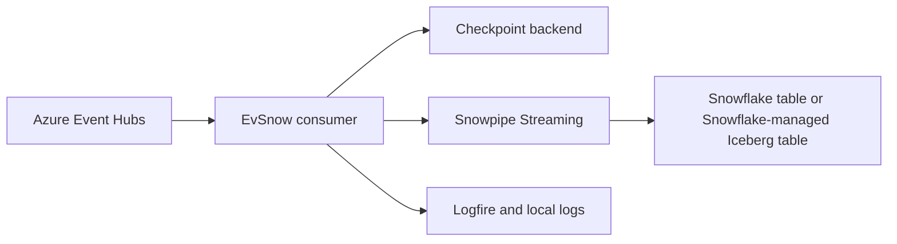
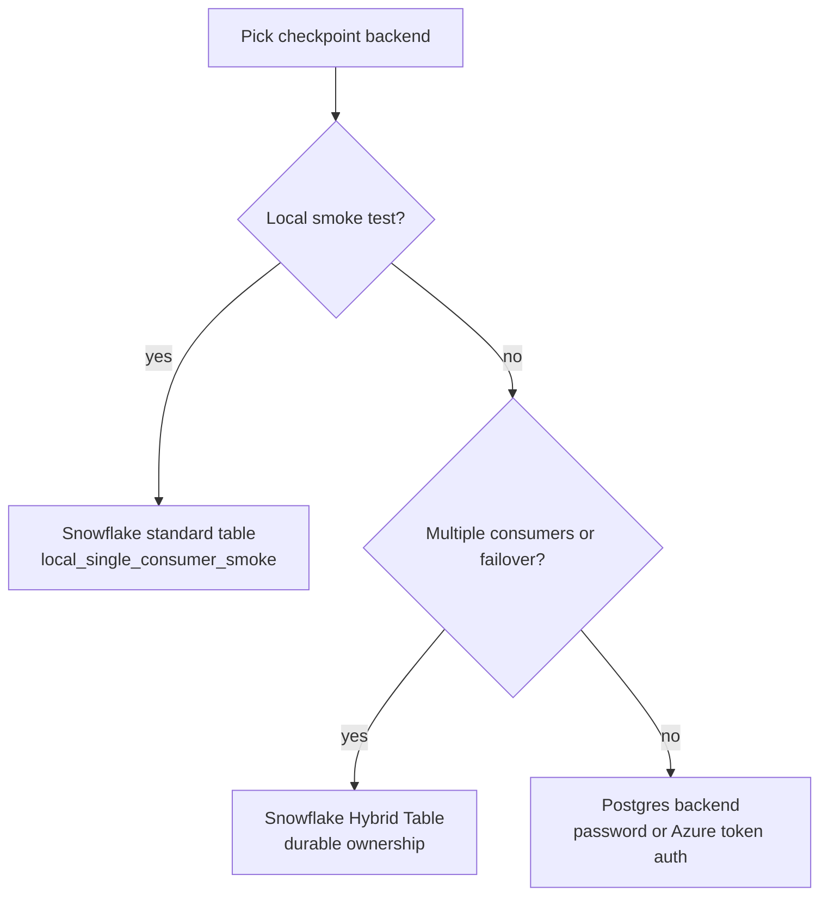

# EvSnow

EvSnow streams events from Azure Event Hubs into Snowflake with checkpointing,
configuration validation, and operational observability.

Start with the first-run tutorial when you want one Event Hub, one Snowflake
target, one checkpoint table, and a repeatable local smoke test.

```bash
uv sync
cp config/evsnow.example.toml config/evsnow.toml
cp .env.example .env
# Edit config/evsnow.toml and .env, then validate.
uv run evsnow validate-config --config-file config/evsnow.toml --env-file .env
```

Those commands install the project, create the editable runtime configuration,
create an editable local environment file, and validate the resolved TOML plus
environment values before the pipeline connects to Azure or Snowflake.

## What EvSnow Connects



The Event Hub consumer reads from configured partitions. EvSnow writes data
through Snowpipe Streaming and records progress in a control backend so later
runs can resume from saved checkpoints.

## Choose Your Path

- New local run: [First run](tutorial/first-run.md)
- Snowflake objects and grants: [Snowflake quickstart](getting-started/snowflake-quickstart.md)
- Full configuration reference: [Configuration](configuration.md)
- Key-pair authentication: [Snowflake key-pair auth](snowflake/key-pair-auth.md)
- Query Iceberg tables from DuckDB: [DuckDB Iceberg guide](how-to/query-iceberg-with-duckdb.md)
- Test and contributor workflow: [Testing](development/testing.md)

## Runtime Choices



The local tutorial uses a Snowflake standard table and
`local_single_consumer_smoke`. Production deployments should use durable
ownership with a Snowflake Hybrid Table or the Postgres control-table backend.

## Documentation Map

The docs are organized like a FastAPI-style guide:

- Tutorial pages show the smallest complete path first.
- Setup pages explain required configuration and Snowflake objects.
- How-to pages solve focused operational tasks.
- Development pages cover tests, workflows, and contributor notes.
- Archive pages preserve implementation plans and historical hardening notes.

## Build These Docs

```bash
uv sync --group docs
uv run zensical build --clean --strict
uv run zensical serve
```

The generated static site is written to `site/`. GitHub Pages deploys that
directory from the documentation workflow after changes land on `main`.
