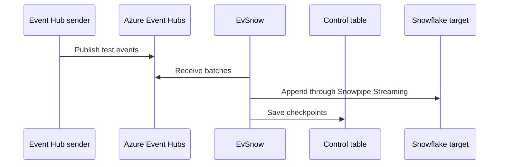

# First Run

This tutorial runs one Event Hub into one Snowflake target with one checkpoint
table. It keeps pipeline shape in TOML and keeps secrets in `.env`.

## Install

```bash
git clone https://github.com/MiguelElGallo/evsnow.git
cd evsnow
uv sync
```

You now have the `evsnow` CLI available through `uv run`.

## Create The Runtime Files

```bash
cp config/evsnow.example.toml config/evsnow.toml
```

Edit `config/evsnow.toml` for your first Event Hub and Snowflake table:

```toml
eventhub_namespace = "eventhub1.servicebus.windows.net"
environment = "development"
region = "local"

[control]
target_db = "CONTROL"
target_schema = "PUBLIC"
target_table = "INGESTION_STATUS"
backend = "snowflake"
ownership_mode = "local_single_consumer_smoke"
use_hybrid_table = false

[eventhub_defaults]
credential_mode = "azure_cli"
starting_position_on_no_checkpoint = "-1"

[event_hubs.EVENTHUBNAME_1]
name = "topic1"
namespace = "eventhub1.servicebus.windows.net"
consumer_group = "$Default"

[snowflake_configs.SNOWFLAKE_1]
database = "INGESTION"
schema_name = "PUBLIC"
table_name = "EVENTS_TABLE1"
batch_size = 100

[[mappings]]
event_hub_key = "EVENTHUBNAME_1"
snowflake_key = "SNOWFLAKE_1"
```

Change only the namespace, Event Hub name, and Snowflake target values for the
first smoke test. `EVENTHUBNAME_1` and `SNOWFLAKE_1` are local mapping keys.

## Create `.env`

```bash
./generate_snowflake_keys.sh
```

Run the printed `ALTER USER` SQL in Snowflake with a role allowed to alter the
target user. Then create `.env`:

```bash
SNOWFLAKE_ACCOUNT=aaaaaa-bbbbbbb
SNOWFLAKE_USER=STREAMEV
SNOWFLAKE_PRIVATE_KEY_FILE=snowflake/rsa_key_encrypted.p8
SNOWFLAKE_PRIVATE_KEY_PASSWORD=your-password
SNOWFLAKE_WAREHOUSE=compute_wh
SNOWFLAKE_ROLE=STREAM
SNOWFLAKE_PIPE_NAME=EVENTS_TABLE_PIPE
```

Do not put pipeline shape keys such as `EVENTHUB_NAMESPACE`, `TARGET_DB`, or
`SNOWFLAKE_1_DATABASE` in `.env` for this path. Environment variables override
TOML, so keeping shape in TOML makes the run easier to inspect.

## Validate

```bash
az login
uv run evsnow validate-config --config-file config/evsnow.toml --env-file .env
```

The Azure identity needs `Azure Event Hubs Data Receiver`. If you use the
included sender utility, it also needs `Azure Event Hubs Data Sender`.

## Dry Run

```bash
uv run evsnow run --config-file config/evsnow.toml --env-file .env --dry-run
```

The dry run validates startup without ingesting events.

## Run The Pipeline

Open terminal 1:

```bash
uv run evsnow run --config-file config/evsnow.toml --env-file .env
```

When startup succeeds, logs show the Event Hub name, Snowflake target, and
`Starting to receive messages`.

Open terminal 2 and send test messages:

```bash
uv run python tools/eventhub_sender/main.py \
  --namespace eventhub1.servicebus.windows.net \
  --eventhub topic1 \
  --count 10000 \
  --batch-size 1000
```

Use the namespace and Event Hub name from `config/evsnow.toml`.

## What Happened



If a batch has `0 messages`, the consumer is connected but no new events have
arrived. After EvSnow saves checkpoints, later runs resume from the saved
offsets and ignore `starting_position_on_no_checkpoint`.

## Next Steps

- Use [Configuration](../configuration.md) for the full TOML and `.env` reference.
- Use [Snowflake key-pair auth](../snowflake/key-pair-auth.md) to troubleshoot RSA authentication.
- Use [Snowflake quickstart](../getting-started/snowflake-quickstart.md) when the target database, pipe, or grants do not exist yet.
- Use [Event Hub sender](../tools/eventhub-sender.md) for repeatable local message sends.
