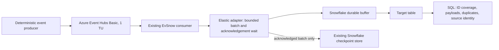

# Elastic Channels implementation and live proof

Repository: `https://github.com/MiguelElGallo/evsnow`.
Checkout: `/Volumes/MPZEXSX5/Github/evsnow-elastic`.
Branch: `mpz/elastic-channels`.

## Design

Keep Named Channels as the compatibility default. Add `channel_mode = "elastic"`
to the Snowflake connection settings and route it to a dedicated adapter using
the official Python SDK (at least 1.8.0). The adapter obtains the implicit Elastic
Channel once and submits each bounded source batch with `append_rows_with_wait`.
Only a successful durable acknowledgement returns success to the consumer.
Caller wait timeouts retain the original Future and its stable batch identity.
A repeated processing attempt observes that Future without resubmitting rows.
Timeouts and append failures prevent the source checkpoint from advancing; late
acknowledgement is observed only through an explicit successful processing attempt.
SDK retries and source replay can
produce duplicates; no Elastic append token is a saved offset or deduplication key.

An acknowledgement establishes durable buffering, not query visibility or
successful table transformation. The live acceptance query must independently
prove that all expected rows reached the table. Retain namespace, hub, partition,
sequence number and the producer's stable event ID in each row for reconciliation.
Do not imply ordering or exactly-once delivery for Elastic mode.

## Implementation steps

1. Research official SDK semantics and Azure Basic limits; peer review this plan
   before implementation.
2. Add validated mode and positive acknowledgement timeout configuration; update
   the generated JSON schema and environment/TOML examples. Upgrade and lock the
   SDK to a version supporting the GA API.
3. Implement an isolated Elastic adapter with lifecycle handling, bounded waits,
   acknowledgement/error counters and explicit at-least-once statistics. Keep the
   existing consumer checkpoint contract and Named adapter.
4. Add meaningful tests for adapter selection, durable acknowledgement, timeout,
   late acknowledgement without resubmission, asynchronous failure, mixed-partition
   partial acknowledgement, checkpoint-write failure after acknowledgement,
   configuration precedence, unchanged checkpoints on failure, and restart/replay
   semantics. Run repository tests, Ruff, ty, and the strict documentation build.
5. Update a how-to, reference, design explanation and reproducible live test tool.
   Peer review implementation and docs; resolve material findings.

## Live test and cost controls

- Verify the current Azure subscription (`OpenAI demos`) and Snowflake account
  (`VAYNIMM-KP67615`, Sweden Central) by authenticated read-only calls.
- Create a uniquely named, tagged resource group containing only this run's
  namespace: Basic, one throughput unit, two partitions, `$Default` consumer group,
  no Capture, auto-inflate, separate compute, or Blob checkpoint storage.
- Use local Azure CLI credentials and narrowly scoped Event Hubs sender/receiver
  access. Keep key material in an ignored local directory.
- Create isolated Snowflake database, runtime role/service user, streaming pipe,
  control table and X-Small warehouse with 60-second auto-suspend. Streaming itself
  uses Snowflake's ingestion service; warehouse compute is for checkpoint SQL and
  verification. Retain the result table for review; suspend the test warehouse.
- Produce exactly 200,000 deterministic events with run ID, event ID and checkable
  payloads. Restart the consumer between two halves to prove persisted recovery.
- Bound Basic producer batches to 240 KiB and publish at 800 events/second. Set a
  bounded SDK close timeout and enable target-table `ERROR_LOGGING`; query its
  `ERROR_TABLE` separately because durable buffering precedes table validation.
- Poll query visibility with a deadline; compare all expected IDs and payloads,
  namespace/hub/partition/sequence metadata, missing IDs and raw duplicates.
  Include an explicit source replay probe to demonstrate Elastic duplicates and
  downstream deduplication. Report observed results without an exactly-once claim.
- Capture sanitized commands, versions, identity, resource SKU, timings, SQL
  results and cleanup read-backs under `docs/development/evidence/`.
- Delete only this run's Azure resource group, including on failure; verify its
  absence through Azure. Do not reuse or delete earlier test resources.

## Peer review

The independent plan review approved isolated implementation and required the
pending-Future rule above, bounded shutdown, negative checkpoint tests, explicit
post-buffer error logging, and Azure Basic request/rate limits. These changes are
incorporated before implementation. The runtime service user will be disabled
after the proof; the isolated Snowflake results remain available for inspection.

## Acceptance

Fresh repository origin is correct; plan and implementation are peer reviewed;
tests, Ruff, ty and docs build pass; the real Elastic adapter carries all 200,000
expected events to Snowflake with matching payloads and restart evidence; source
replay behavior is documented; Azure test resources are confirmed deleted; local
secrets are absent from tracked artifacts. Publication is a separate user request.

## Official references

- [Elastic overview](https://docs.snowflake.com/en/user-guide/snowpipe-streaming/snowpipe-streaming-elastic-channels-overview)
- [Elastic limitations](https://docs.snowflake.com/en/user-guide/snowpipe-streaming/snowpipe-streaming-elastic-channels-limitations)
- [Python API](https://docs.snowflake.com/en/user-guide/snowpipe-streaming-sdk-python/reference/latest/api/snowflake/ingest/streaming/index)
- [Event Hubs tiers](https://learn.microsoft.com/en-us/azure/event-hubs/compare-tiers)
